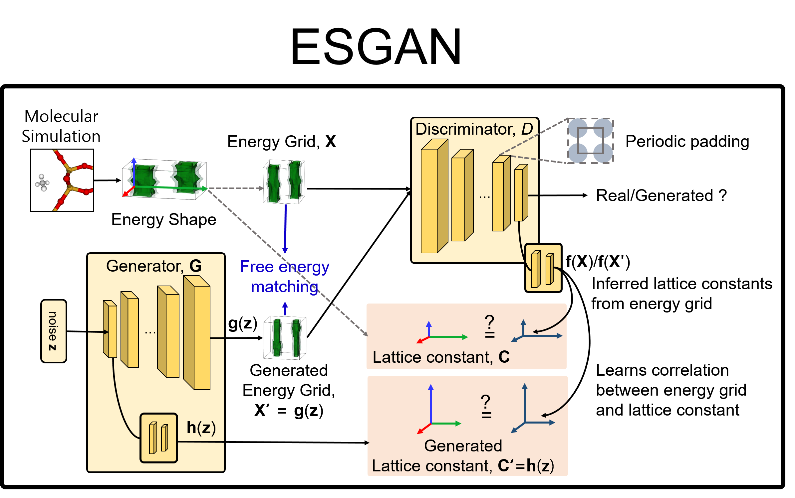

# Energy Shape GAN (ESGAN)

`Tensorflow 1.x` implementation of [ESGAN](http://pubs.rsc.org/en/Content/ArticleLanding/2019/TA/C8TA12208C).




## Dataset preparation

You can generate energy shapes using [GRIDAY](https://github.com/Sangwon91/GRIDAY) from `cssr` files.

## Input arguments

```
--dataset_path             /path/to/dataset
--device                   1
--logdir                   /path/to/logdir
--z_size                   1024
--voxel_size               32
--rate                     0.5
--move                     True
--rotate                   True
--invert                   True
--energy_limit             -3500 5000
--energy_scale             -3500 5000
--cell_length_scale        0.0 100.0
--save_every               1000
--batch_size               32
--bottom_size              4
--bottom_filters           256
--top_size                 4
--filter_unit              32
--d_learning_rate          1e-4
--g_learning_rate          1e-4
--minibatch                False
--minibatch_kernel_size    256
--minibatch_dim_per_kernel 5
--l2_loss                  False
--train_gen_per_disc       1
--feature_matching         True
--in_temper                300.0
#--restore_ckpt
```
